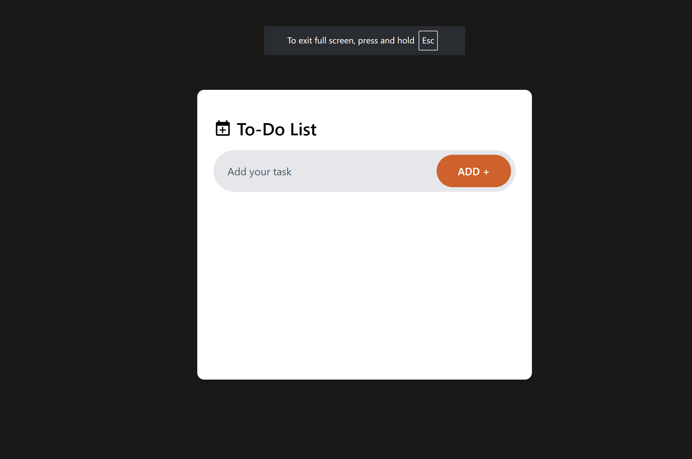

# My To-Do List App 📝

A simple **To-Do List app** built with **React**, **Vite**, and **Tailwind CSS**.  
Add, complete, delete tasks and save them in **localStorage**.

---

## 🖼 Screenshot



---

## 🚀 Live Demo

Check out the live demo here: [My To-Do List App](https://myytoodoo.netlify.app/)

---

## ⚡ Features

- Add tasks
- Mark tasks as complete
- Delete tasks
- Tasks saved in localStorage
- Responsive UI
- Neon hover effect for buttons

---

## 🛠 Tech Stack

- React
- Vite
- Tailwind CSS
- JavaScript (ES6)
- LocalStorage API

---

## 💻 Getting Started

1. Clone the repo:

```bash
git clone https://github.com/Omhari66/my-todo-list.git
cd my-todo-list
